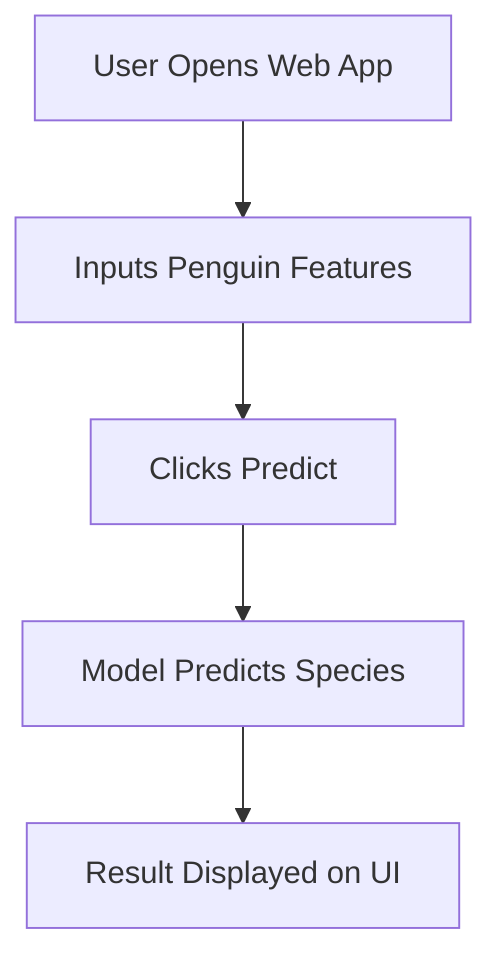

# Penguin-Species-Predictor

A penguin species prediction app built with FastAPI and Streamlit


## Introduction

Penguin Species Predictor is a machine learning project that predicts the species of penguins based on their physical characteristics. Using data from the Palmer Penguins dataset, this repository provides an interactive web application for users to explore the data and make predictions. The aim is to offer an educational and practical tool for data science enthusiasts to understand classification models and their implementation.


## Sidebar: User Input Features 

The sidebar collects measurement inputs from the user.  

| Feature             | Widget     | Options / Range                  |
|---------------------|------------|----------------------------------|
| **Island**          | selectbox  | Biscoe, Dream, Torgersen         |
| **Gender**          | selectbox  | male, female                     |
| **Bill length (mm)**| slider     | 32.1 – 59.6 (default 43.9)       |
| **Bill depth (mm)** | slider     | 13.1 – 21.5 (default 17.2)       |
| **Flipper length**  | slider     | 172 – 231 (default 201)          |
| **Body mass (g)**   | slider     | 2700 – 6300 (default 4207)       |


## Requirements

To ensure smooth operation, install the following:

Backend:
- FastAPI
- Uvicorn
- Pandas
- Numpy
- scikit-learn

Frontend:
- Streamlit
- Requests
- Pandas


## Application Flow



## Installation

Follow these steps to set up the project on your local machine:

1. **Clone the repository:**
   ```bash
   git clone https://github.com/VinothiniRamsingh/Penguin-Species-Predictor.git
   cd Penguin-Species-Predictor
   ```

2. **Create a virtual environment (for both backend and frontend):**
   ```bash
   python -m venv venv
   source venv/bin/activate    # On Windows: venv\Scripts\activate
   ```

3. **Install the required packages:**
   ```bash
   pip install -r requirements.txt
   ```

4. **Download the dataset (if not already included):**
   - The Penguins dataset is usually included in the repository or fetched automatically.
  

## Usage

To start using the Penguin Species Predictor web application:

1. **Run the Streamlit application:**
   ```bash
   streamlit run app.py
   ```
2. **Access the application:**
   - Open your browser and navigate to the displayed local URL (typically `http://localhost:8501/`).

3. **Using the Application:**
   - Explore the dataset via the provided visualizations.
   - Input penguin measurements (bill length, bill depth, flipper length, body mass, island, sex) using the sidebar.
   - Click the "Predict" button to get the species prediction.
   - Download prediction results if needed.
  


## Live Demo App

(https://predict-penguin-species.streamlit.app/)


